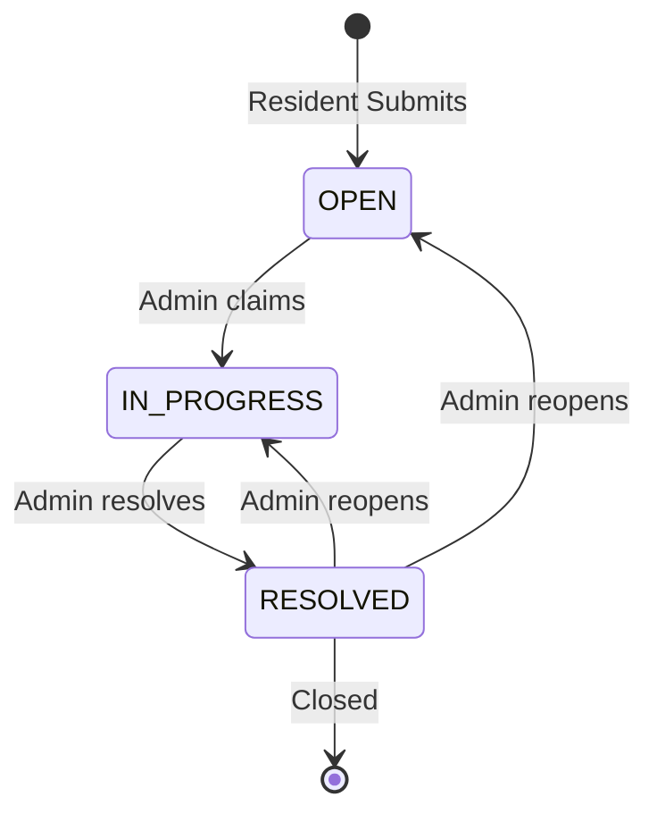
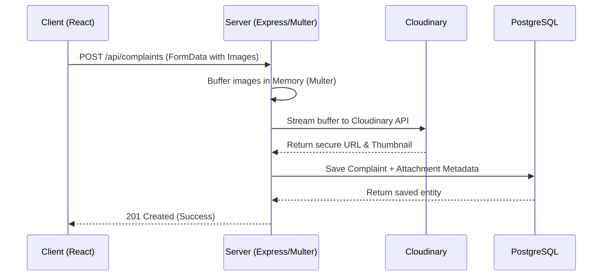

# SocietyHub System Design Write-up

This document outlines the architectural decisions and technical design of the Society Maintenance Tracker application, specifically focusing on the complaint history model, overdue detection, photo handling, and notification flow.

## 1. Complaint History Model & State Machine

The core requirement of the application is a fully traceable complaint lifecycle (Open → In Progress → Resolved). To ensure data integrity and full auditability, the system uses an event-driven schema model with strict state machine validation.

**Architecture:**
*   **Entities:** The system separates the current state (`Complaint`) from the audit log (`ComplaintHistory`).
*   **State Machine Validation:** When an Admin attempts to update a status (e.g., via `updateComplaintStatus`), the backend validates the transition. 

*   **Transactional Logging:** When a valid status change occurs, the backend uses a `prisma.$transaction` block. This block updates the `Complaint.status` field and synchronously inserts a new `ComplaintHistory` record containing the `actorId` (the user making the change), `previousStatus`, `newStatus`, a `timestamp`, and an optional `note`. 

By strictly decoupling the current state from the append-only history log, residents get a transparent timeline of their issue, and admins can accurately measure SLA performance without data manipulation risks.

## 2. Overdue Detection & Priority Handling

To prevent maintenance issues from slipping through the cracks, the application features an automated overdue detection mechanism that dynamically flags aging complaints.

**Architecture:**
*   **Configurable SLA Threshold:** The system relies on a configurable threshold (`COMPLAINT_OVERDUE_HOURS`, defaulting to 48 hours) defined in the environment variables and synchronized into the `SystemSetting` table.
*   **Dynamic Computation vs. Stale State:** Instead of running a cron job that mutates a boolean `isOverdue` field on the database row (which can lead to race conditions and stale states), overdue status is computed dynamically. 
*   **Implementation:** The backend calculates a `cutoff` date (Current Time - SLA Hours). When querying complaints (e.g., `/api/admin/overdue` or the main `/api/complaints` list), it queries for `status !== 'RESOLVED'` and `createdAt < cutoff`. 
*   **Admin Surfacing:** When the Admin fetches all complaints, the backend intercepts the results and applies a sorting algorithm that bubbles all `isOverdue` complaints to the top of the dataset. This ensures that the frontend natively renders critical, aging tickets before newer ones, maximizing visibility.

## 3. Photo Handling & Cloud Storage

Residents must be able to attach visual proof to their maintenance complaints. Because handling raw binary image data in a PostgreSQL database is inefficient and scales poorly, the system uses a distributed approach.

**Architecture:**
*   **Multipart Processing:** The Node.js backend utilizes `Multer` to intercept `multipart/form-data` requests. Files are held briefly in memory buffers rather than written to the local disk, which makes the app suitable for ephemeral, serverless, or containerized deployments.

*   **Cloud CDN Integration:** The buffered files are immediately streamed to **Cloudinary** using a custom Promise-based wrapper. Cloudinary handles image optimization, auto-formats the image for web performance, and returns a secure, persistent URL.
*   **Database References:** The backend then stores only the structural metadata in the `ComplaintAttachment` table: the persistent `fileUrl`, `fileName`, and `mimeType`. 
*   **Multi-Image Support:** The schema and endpoints are built with a one-to-many relationship, allowing up to 10 photos per complaint. The frontend handles previews and progressive upload states, while the backend attaches all returned URLs to the Complaint creation transaction.

## 4. Notification Flow

Timely communication is a critical requirement. Residents must be notified when important notices are broadcasted or when their personal complaint status changes.

**Architecture:**
*   **Asynchronous Processing (`notifyQuietly`):** Email generation and transmission can be slow (often taking 1-3 seconds via SMTP or HTTP API). If email sending were synchronous, the user would experience a significant delay when creating a complaint or updating a status. To solve this, the app uses a fire-and-forget utility called `notifyQuietly()`.
*   **Execution:** When a state changes (e.g., an Admin marks a ticket as "In Progress"), the API responds to the client immediately with a `200 OK` status, completing the HTTP request. Simultaneously, `notifyQuietly()` executes in the background Node event loop.
*   **Resiliency:** The utility catches and logs its own errors. If the SMTP server (Nodemailer/Resend) fails or times out, the backend logs the failure to the console but does not crash the application or rollback the successful database transaction.
*   **Templates:** The system uses a centralized HTML template generator to ensure all emails share a consistent, branded, responsive layout.

This non-blocking architecture ensures a snappy, responsive UI while maintaining reliable delivery of critical system notifications to residents.
